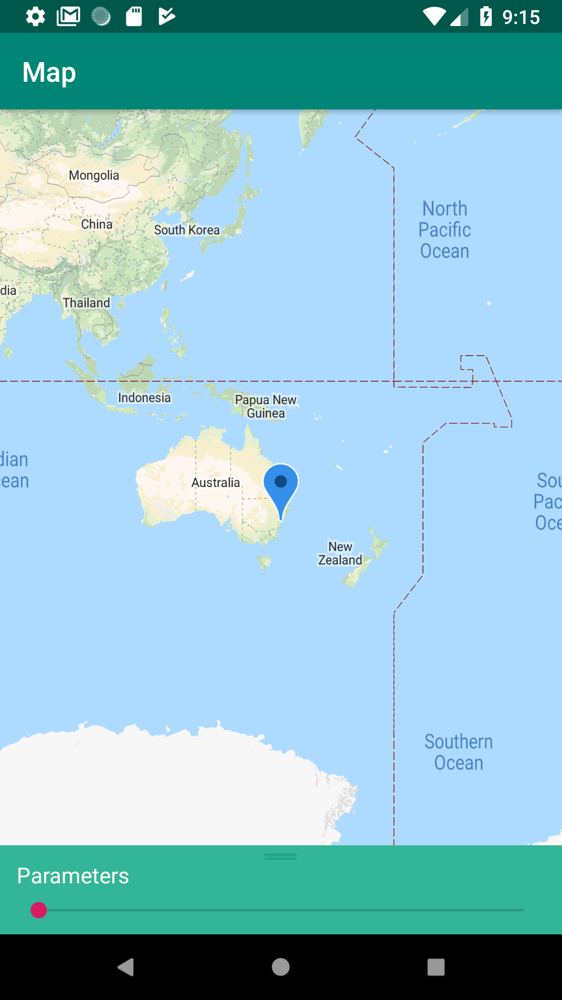

# Filter cities shown on map

The goal is to have a couple of nice sliders (such as population-min-max) and other parameters: as you change them you update which cities are shown on the map. Possibly from a API somewhere

